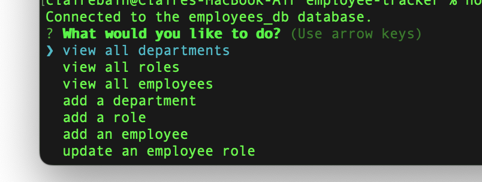

# employee-tracker

Description: This application uses node.js and mySQL to create, store, add to, and edit an employee database. Users run the application from the command line, where they can select from a list of options to view employees, departments, and roles, add an employee, department, or role, or update an employee's role. The database consists of three tables: employee, department, and roles, that are linked together by foreign keys.

Installation: N/A

Usage: Click here for a walk-through video: https://drive.google.com/file/d/1IEddGlVg8DH6TG6A6y_9qdfdadzhNzSi/view

Credits: N/A

License: Please refer to the license in the repo

